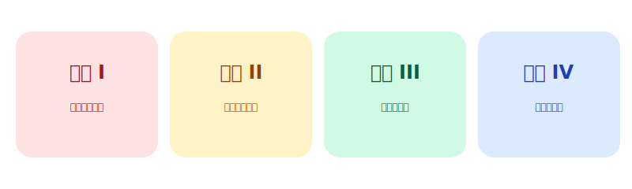

# 🎓 马原在线备考平台：marx.zeabur.app 全面进化

**告别本地离线题库，迈入“云端智能复习”时代。**

---

## 🌐 访问入口：[marx.zeabur.app](https://marx.zeabur.app/)

无论你在图书馆的电脑前，还是在回寝室的地铁上，你的专属“马原题库”永远在线。

---

## 🚀 深度升级：带你领略顶级刷题交互

### 1️⃣ 打字机式流式 AI · 知识实时触达

在 **marx.zeabur.app** 结果页，AI 解析不再需要漫长的转圈等待。
- ⚡ **实时响应**：解析内容如流水般跳动，学习效率提升 300%。
- 🤖 **保姆级辅导**：AI 自动开启“人话翻译”模式，把生涩原理变成通俗案例。
- 💬 **无限深度追问**：点击“追问老师”，直到把知识点彻底刻进大脑。

---

### 2️⃣ 1000+ 专项云端补丁 · 全场景覆盖
我们不仅拥有原有的基础题库，更在今日同步上线了 **1000+ 高质量新增题源**。四大专项模块精准锁定你的薄弱环节：

- ✅ **原生简答/填空支持**：在页面上直接打字练习，还原真实的期末考场手感。

---

### 3️⃣ 结构化资产中心 · 你的笔记会“呼吸”
复习不再是乱糟糟的草稿纸。**marx.zeabur.app** 为你提供了专业的数字化笔记中心：
- 📦 **自动封装**：一键将题目、正确答案、你的感悟打包归档。
- 🔄 **智能回弹**：业内领先的滚动定位技术，展开/关闭解析时，页面自动平滑回滚，视觉体验极致舒适。
- ✍️ **Markdown 实验室**：全屏编辑，实时预览，让你的复习资料具有论文级的排版。

---

### 4️⃣ 题目收藏 · 打造你的“高分必过集”
点击题目旁的 **⭐ 星星**，即可将其送入收藏夹。
- **动态复练**：在收藏夹内直接答题，AI 实时纠错反馈。
- **云端同步**：只要有账号，收藏的错题在任何设备上都能看到。

---

## 💎 会员权益与解锁路径 (Membership)

| 核心赋能项 | 普通模式 | 高级 VIP (邀请1人) | 精英 SVIP (邀请≥5人) |
|:---|:---:|:---:|:---:|
| 站点基础 8 章核心题库 | ✅ | ✅ | ✅ |
| **1000 题专项题库解锁** | ❌ | **立即开放** | **立即开放** |
| **流式 AI 全卷笔记沉淀** | ❌ | **永久激活** | **永久激活** |
| **保姆级 AI 深度辅导** | ❌ | **基础版** | **全要素增强版** |
| **AI 老师 1v1 无限追问** | ❌ | ❌ | **专属特权** |

---

## 💰 一杯奶茶，换一次稳过的期末

### 🎁 激活码仅需

# ￥6

**与其在考场上追悔莫及，不如在 [marx.zeabur.app](https://marx.zeabur.app/) 抢占先机。**

---

### 关注公众号「清言观」

获取注册秘钥、题库更新及技术支持

---

*© 2025 清言观 · 构建马原学习新标准*

